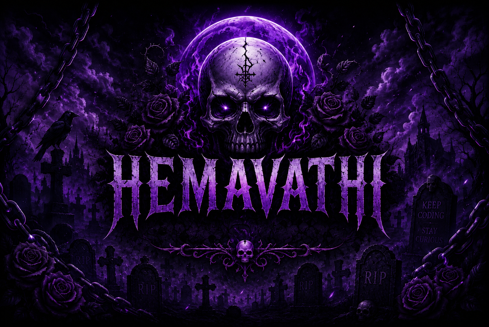

# 💀 Hema's Digital Graveyard 💀

### ☠️ Python • Data Science • Learning • Building ☠️ 

---

## 🦴 About Me

Hey, I'm **Hema**👋

💀 Passionate about **Data Science** and problem solving

🐍 Strong in **Python**

📚 Currently learning software development and modern technologies

🚀 Built multiple Python-based projects and web applications

✨ Always curious, always improving

---

## 💀 Tech Stack

### Languages

### Frontend

### Tools

## 💀 Featured Projects

| Project                    | Description                                                                                                                                   |
| -------------------------- | --------------------------------------------------------------------------------------------------------------------------------------------- |
| 🤖 Context Chatbot         | An intelligent Python chatbot designed to maintain conversation context and provide more meaningful responses based on previous interactions. |
| 💰 Personal Budget Tracker | A Python-based finance management tool that helps users track expenses, monitor spending habits, and manage personal budgets efficiently.     |
| 🎮 Simon Says Game         | A fun memory challenge game built using HTML, CSS, and JavaScript where players repeat increasingly complex color sequences.                  |

---

## 📊 GitHub Statistics

---

## 📬 Contact Me

💼 LinkedIn: https://www.linkedin.com/in/g-hemavathi/

💻 GitHub: https://github.com/HemaG88

📧 Email: [hemasuki7259@gmail.com](mailto:hemasuki7259@gmail.com)

⚡ Netlify: https://tiny-kangaroo-632720.netlify.app/

---

### 💜 "The Graveyard Of Bugs Begins Here." 💜

